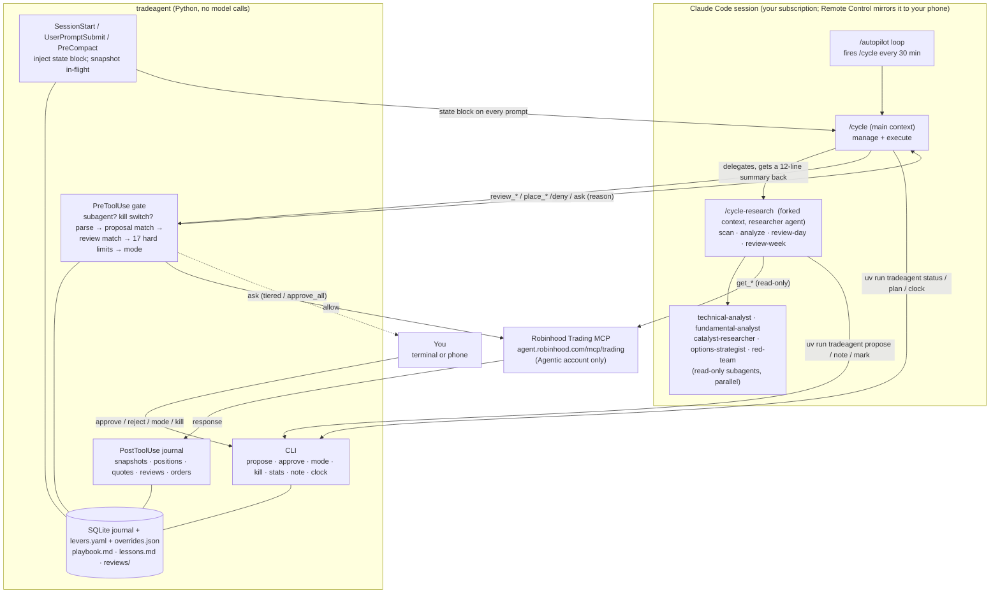

# robinhood_trading_agent

A Claude Code trading agent for a Robinhood **Agentic** brokerage account, wrapped in an enforcement layer
the model cannot bypass. Runs hands-free for weeks, or with you approving each trade from your phone.

- **Agent**: Claude Code itself (your claude.ai subscription, no API key), connected to Robinhood's official
  Trading MCP server (`https://agent.robinhood.com/mcp/trading`).
- **Levers and permissioning**: `tradeagent`, a small Python package driven by Claude Code hooks. Every
  `place_*_order` call passes through a gate (proposal match → review-before-place → hard limits → autonomy
  mode) before it can reach the broker. Everything is journaled in SQLite.
- **Rigor**: the mandate in `CLAUDE.md`, the workflow in `.claude/skills/`, and six read-only subagents
  (technical, fundamental, catalyst, options strategist, red-team, researcher) in `.claude/agents/`.

Robinhood enforces almost nothing on its side: no per-order caps, no loss limits, no kill switch, and
"approve first" is only an instruction to the agent. This repo is where those controls live.

## Architecture

Three layers share one state: the SQLite journal. The conversation is scratch space; the database is the
truth, and hooks re-inject it into every prompt.



Control points, in order of authority: `permissions.deny` (the model cannot edit config, hooks, mandate,
skills, or the package), the gate on every `place_*` call, `permissions.allow` (read tools and the CLI are
pre-approved; `place_*` is deliberately absent, so only the gate's explicit allow lets an order through),
and the levers file, re-read on every call.

One autopilot tick during market hours:

```mermaid
sequenceDiagram
    autonumber
    participant L as /autopilot loop
    participant M as main session (/cycle)
    participant H as hooks (tradeagent)
    participant DB as journal
    participant R as researcher (fork)
    participant RH as Robinhood MCP

    L->>M: /cycle
    H->>DB: read state
    H-->>M: inject state block + clock + status
    M->>RH: get_portfolio, get_*_positions, get_*_quotes
    RH-->>H: responses
    H->>DB: snapshot, positions, quotes (cash-flow detection)
    M->>M: /manage: positions vs plan → exit proposals if flagged
    M->>M: /execute: for each approved / auto-eligible proposal
    M->>H: review_equity_order(params)
    H->>DB: record review hash
    M->>H: place_equity_order(same params)
    H->>DB: proposal match, review match, limits, mode
    alt allowed
        H->>RH: order goes through
        RH-->>H: broker response
        H->>DB: order + broker id; proposal → placed
    else denied / dry run
        H-->>M: reason (never retry same params)
    end
    opt free slots and no scan yet today
        M->>R: /cycle-research scan
        R->>RH: scans, watchlists, historicals, fundamentals (read-only)
        R->>R: analysts in parallel → red-team
        R->>DB: tradeagent propose → sized proposal (auto_eligible / pending)
        R-->>M: 12-line summary
        M->>M: /execute again
    end
    M-->>L: 5-line tick report
```

## Setup

```bash
# 1. Python side (uv: https://docs.astral.sh/uv/)
uv sync
uv run tradeagent init            # writes config/levers.yaml and data/tradeagent.db (defaults: approve_all, dry_run ON)
uv run pytest                     # 63 tests

# 2. Claude Code side (from this folder, interactively, on a desktop)
claude                            # accept workspace trust; approve the project MCP server when asked
/mcp                              # authenticate robinhood-trading (browser OAuth; creates the Agentic account on first connect)
/status                           # renders the gate state
```

In that session ask for `get_accounts` and `get_portfolio`. The agent uses the one account with
`agentic_allowed: true`. The first raw response per tool is saved under `data/samples/` (gitignored) so
parsers can be checked with `uv run tradeagent inspect <tool>`.

## Daily use

| Command | What it does |
|---|---|
| `/status` | mode, dry run, P&L vs limits, positions, pending approvals, cash flows |
| `/scan [intraday]` | scanners, watchlists, earnings/macro calendar → ranked shortlist (never trades) |
| `/analyze TICKER [swing\|intraday] [option]` | parallel analysts + red-team → proposal JSON → `tradeagent propose` |
| `/execute` | review → place every approved / auto-eligible proposal through the gate |
| `/manage` | positions vs their plan (stop / target / invalidation / time stop) → exits |
| `/review-day` | reconcile, P&L, post-mortems, symbol notes, lessons, `data/reviews/<date>.md` |
| `/review-week` | rewrite the bounded playbook from stats + reviews; monthly lever proposals |
| `/pending`, `/approve <id>`, `/reject <id>` | the approval queue |
| `/mode approve_all\|tiered\|autonomous`, `/kill [off]` | autonomy and emergency stop |
| `/cycle` | one autopilot tick: manage + execute here, scan/analyze/review in a forked context |
| `/autopilot [30m]` | run `/cycle` now and every 30 minutes for as long as the session is open |

Terminal equivalents: `uv run tradeagent status | pending | approve <id> | reject <id> | mode <m> | kill on|off |
dry-run on|off | orders | decisions | positions | plan | stats | inspect <tool> | show <id> | reset <id> | halt |
cashflow <amount> | note SYM "..." | notes SYM | lessons | reviews | clock | mark <step>`.

## Hands-free operation

```
claude --remote-control "Trading autopilot"    # start the session so your phone can follow it
/mode autonomous                               # or tiered: small orders auto, the rest prompt you
/autopilot
```

`/cycle` reads `tradeagent clock` and does the right thing for the phase: pre-market scan and analyze,
manage and execute while open, manage only after the 15:30 ET cutoff, daily review after the close, weekly
review on the last trading day of the week, nothing on weekends and holidays. Steps done today are recorded
so nothing repeats. `/kill` blocks orders instantly. Keep the Mac awake (`caffeinate -i`); sleep pauses the
loop, wake resumes it.

**From your phone** (Claude app, Remote Control): the live session, every tool call, messages you send
(`/kill`, `/pending`, `/mode ...`), and permission prompts. In `tiered` or `approve_all` mode the gate's
"approve this order?" prompt lands on the phone, so analysis and execution stay hands-off while trades wait
for your tap. Enable "Push when actions required" in `/config`.

**Unattended (terminal closed)**: `scripts/launchd/install.sh` installs macOS launchd agents that run
`claude -p "/<skill>"` headless on weekdays: 08:30 scan, `/manage` every 30 min, `/execute` at 09:50 and
13:05, 14:30 intraday scan, 16:15 review. Headless runs cannot prompt, so anything needing approval queues
for `tradeagent approve <id>`. See `scripts/launchd/README.md`.

## Modes

| Mode | Interactive session | Headless run |
|---|---|---|
| `approve_all` | every order prompts you (phone or terminal) | every order queues |
| `tiered` | orders ≤ `auto_max_notional_usd`, confidence ≥ `auto_min_confidence`, in already-traded symbols (options excluded by default) and risk-reducing exits pass; the rest prompt | same, the rest queue |
| `autonomous` | everything inside the hard limits passes | same |

`dry_run` is independent of mode: when on, the gate denies every order and journals a simulated fill at the
last quote, so the whole loop (P&L, stats, reviews) runs at zero risk. `uv run tradeagent dry-run off` asks
for confirmation.

## Levers (`config/levers.yaml`)

```yaml
mode: approve_all          # approve_all | tiered | autonomous    (uv run tradeagent mode ...)
kill_switch: false         # uv run tradeagent kill on|off
dry_run: true              # paper mode
paper_equity_usd: 500      # equity assumed in dry run until a real snapshot exists
risk:      max_order_notional_usd, max_position_pct, max_open_positions, max_daily_loss_pct,
           max_weekly_loss_pct, risk_per_trade_pct, min_reward_risk, max_trades_per_day,
           cooldown_minutes_same_symbol, equity_floor_usd, fractional_shares, fractional_decimals,
           min_order_notional_usd
tiered:    auto_max_notional_usd, auto_min_confidence, new_symbol_requires_approval,
           options_require_approval, exits_auto_allowed
universe:  allowlist, blocklist, min_price, min_avg_dollar_volume, exclude_earnings_within_days
options:   enabled, risk_per_trade_pct, max_premium_per_trade_usd, max_options_exposure_pct,
           dte_min, dte_max, max_contracts, min_open_interest, max_bid_ask_spread_pct
session:   allowed_hours, no_new_positions_after, require_fresh_snapshot_minutes,
           require_review_before_place, require_proposal_for_place, proposal_ttl_hours,
           limit_price_tolerance_pct
```

The YAML is re-read on every tool call. Runtime toggles (`mode`, `kill_switch`, `dry_run`) go to
`data/overrides.json` and win over the YAML. The shipped values are tuned for a **$500 account**: $200 max
per order, 40% max per symbol, 3 positions, 3% risk per trade (6% for options), 4% daily / 8% weekly loss
halt, fractional shares on, options limited to contracts under $0.50 premium. Percentage levers rescale
with equity automatically; dollar caps do not, so raise them when you fund the account.

### What the gate does on `place_*_order`

1. subagent? kill switch? → deny
2. parse the order (unknown field names → deny, fail closed; dollar-based orders need a limit price)
3. match a stored proposal (symbol, side, instrument, qty ≤ sized max, limit within tolerance) → else deny
4. a `review_*_order` with identical params in the last 30 min → else deny
5. hard limits: market hours, 15:30 cutoff, fresh snapshot (live only), equity floor, daily/weekly loss,
   notional, buying power, position %, open-position count, trades/day, cooldown, universe, liquidity,
   earnings window, options rules (DTE, contracts, premium, exposure), exit qty ≤ held
6. mode decides (table above)
7. `dry_run` → deny with a simulated fill recorded; otherwise allow and mark the proposal executing

Sizing is code, not model: `tradeagent propose` prints `max_qty` from the stop distance and every cap; the
model may go smaller, never larger. Deposits and withdrawals are detected from `get_portfolio` (cash and
equity moving together with no fills) and shift the P&L baselines instead of reading as gains or losses;
`tradeagent cashflow <amount>` is the manual override.

## Long-running sessions: context and memory

- **State is the journal, not the conversation.** Every prompt, and every SessionStart including the one
  Claude Code fires after a context compaction, gets a fresh state block: mode, P&L, positions, in-flight
  proposals and orders, cycle steps done today, the playbook, and the latest lessons. A `PreCompact` hook
  also writes `data/inflight.md` for the human log.
- **Research runs in forked contexts.** `/cycle` keeps manage and execute in the main session and delegates
  scan, analyze and reviews to `/cycle-research` (a `context: fork` skill on the `researcher` agent, which
  cannot place orders). A tick adds a few thousand tokens to the session instead of tens of thousands.
- **Three memory tiers, all bounded:** `data/playbook.md` (≤ 40 lines, rewritten weekly by `/review-week`,
  injected every prompt), symbol notes in SQLite (`tradeagent note/notes`, shown in `/analyze` and
  `/manage`), and the raw archive (`data/lessons.md`, `data/reviews/`, the database). On the last trading
  day of a month `/review-week` drafts `data/reviews/levers-YYYY-MM.md` for you to apply.
- **The mandate is locked.** `.claude/settings.json` denies the model writes to `config/`, `CLAUDE.md`, the
  skills, agents, hooks, scripts, `.mcp.json`, `lessons.md` (CLI only) and the `tradeagent/` package.

## Going live (suggested ladder)

1. `dry_run: true`, `mode: approve_all` for a few sessions. Read the proposals, `tradeagent decisions`, and
   `data/samples/`; fix `tradeagent/fieldmap.py` aliases if a field parses as n/a.
2. `uv run tradeagent dry-run off` with one manually approved fractional order. Confirm the broker order id
   in `tradeagent orders` and `get_equity_orders`. Note the exact `place_equity_order` field names in the
   samples; the gate parser is alias-driven and fails closed on unknown shapes.
3. `tiered` once `tradeagent stats` shows positive expectancy over a meaningful sample; `autonomous` only
   with limits you would accept losing in one bad day.

## Layout

```
CLAUDE.md                 mandate, hard rules, account conventions, analysis/execution standard
.mcp.json                 robinhood-trading HTTP MCP server (no secrets)
.claude/settings.json     permissions (read tools allowed; place_* only via the gate) + hooks + deny list
.claude/hooks/            hook wrapper → python -m tradeagent.hooks <event>
.claude/agents/           technical-analyst, fundamental-analyst, catalyst-researcher, options-strategist, red-team, researcher
.claude/skills/           status, mode, kill, pending, approve, reject, scan, analyze, propose, execute, manage,
                          review-day, review-week, cycle, cycle-research, autopilot
config/levers.yaml        every lever
tradeagent/               config, models, db, fieldmap (parsers), snapshot, sizing, limits, pnl, journal, gate,
                          hooks, report, stats, cli
scripts/run.sh            headless runner; scripts/launchd/ scheduling
bin/tradeagent            CLI wrapper using the project venv
data/ (gitignored)        tradeagent.db, overrides.json, lessons.md, playbook.md, inflight.md, samples/, reviews/, runs/, hooks.log
proposals/ (gitignored)   proposal JSON files written by /analyze and /manage
tests/                    pytest: gate per mode, limits, sizing, cash flows, parsers, market clock, hook subprocess
```

## Known constraints

- Robinhood's MCP: long single-leg options only, no margin, no shorting, no paper environment, undocumented
  request/response formats (responses carry a `guide` string with presentation hints), no streaming quotes
  (intraday means polling every ~30 minutes). Options must be enabled on the Agentic account itself; the
  agent points you at `get_option_level_upgrade_info` when they are not. Crypto is disabled here.
- Claude Code hooks in `.claude/settings.json` run only after workspace trust has been accepted once in an
  interactive session in this folder. `claude -p` runs and long autopilot sessions use your subscription
  quota. Remote Control needs the Mac awake.
- The repo is public; `data/` and `proposals/` are gitignored because they contain account numbers and
  positions. Do not force-add them.
- You are liable for every order the agent places, in every mode.
